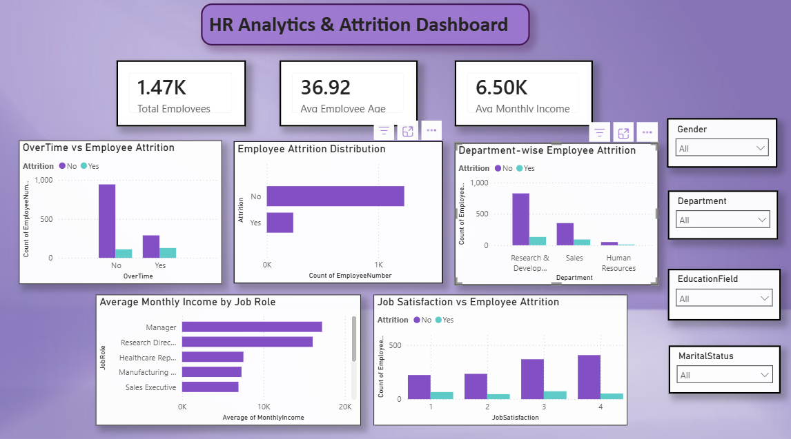

# HR Analytics & Attrition Dashboard

## Project Overview
This project focuses on analyzing employee attrition trends using Python and Power BI.  
The goal was to identify key factors affecting employee attrition and create an interactive dashboard for business insights.

The project includes:
- Data cleaning and exploration using Python
- Exploratory Data Analysis (EDA)
- Business insight generation
- Interactive Power BI dashboard creation

---

# Tools & Technologies Used

- Python
- Pandas
- NumPy
- Matplotlib
- Power BI
- Jupyter Notebook

---

# Project Workflow

## 1. Data Collection
Used the IBM HR Analytics Employee Attrition dataset from Kaggle.

## 2. Data Cleaning & Exploration
Performed:
- Dataset inspection
- Missing value checks
- Statistical summaries
- Exploratory Data Analysis (EDA)

## 3. Data Visualization
Used Matplotlib for:
- Attrition analysis
- Overtime analysis
- Department-wise trends
- Job satisfaction analysis
- Salary analysis

## 4. Power BI Dashboard
Created an interactive dashboard with:
- KPI Cards
- Attrition Analysis
- Department-wise Insights
- Salary Insights
- Slicers/Filters

---

# Key Insights

- Employees working overtime showed higher attrition.
- Research & Development had the highest employee count and attrition volume.
- Employees with lower job satisfaction were more likely to leave.
- Salary distribution varied significantly across job roles.
- Attrition trends differed across departments and employee demographics.

---

# Dashboard Features

- Total Employee Count
- Average Employee Age
- Average Monthly Income
- OverTime vs Attrition Analysis
- Department-wise Attrition
- Job Satisfaction Analysis
- Interactive Slicers
    - Gender
    - Department
    - Education Field
    - Marital Status

---

# Dashboard Screenshot



---

# Repository Structure

```text
hr-analytics-attrition-dashboard/
│
├── data/
│   ├── WA_Fn-UseC_-HR-Employee-Attrition.csv
│   └── cleaned_hr_data.csv
│
├── notebooks/
│   └── cleaned_hr_data.ipynb
│
├── dashboard/
│   └── HR_Analytics_Project.pbix
│
├── images/
│   └── Dashboard.png
│
└── README.md
